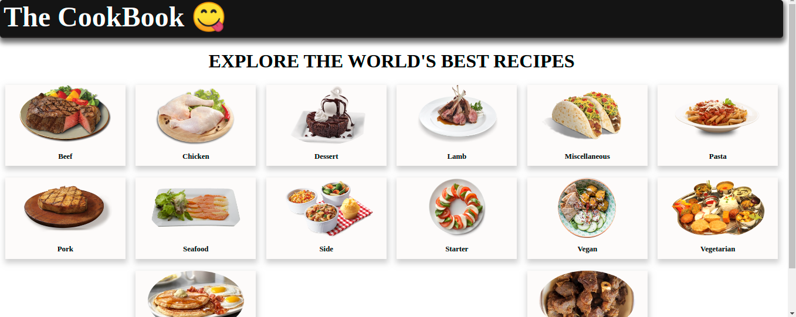
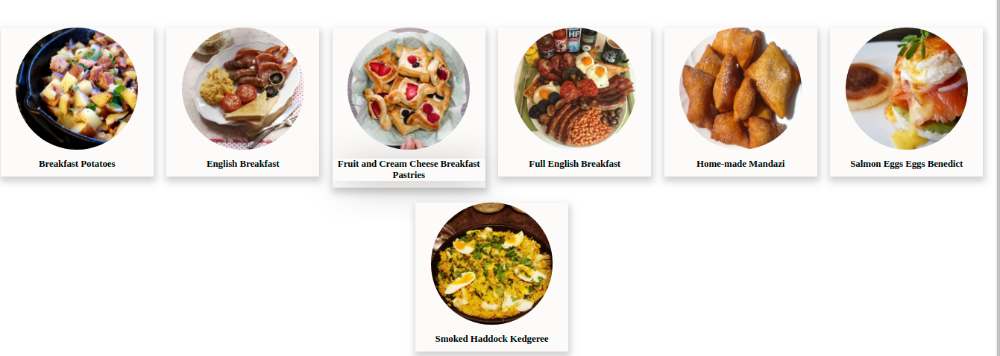
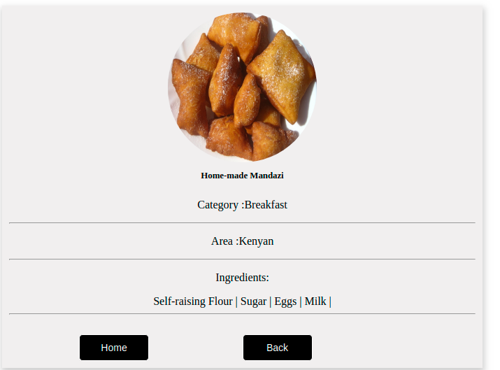

<h1 align="center"> The CookBook</h1>

The objective of this project was to create a single page recipe catalogue using React, Redux and TheMealDB API. 

## Features
- A user can view all the meals in the CookBook

- A user can click on any category and get to see the meals listed under that category and in this case we are seeing the breakfast category.

- A user can choose a category to view e.g beef only, Chicken only

- Under each category, a user gets to see a variety of dishes to make a choice from.
- Each dish chosen has a list of all the ingredients that were used to prepare it, area where it originates from and the category it belongs to

## [Demo Link](https://the-recipebook.herokuapp.com/)

## TOOLS

- HTML
- CSS
- JavaScript
- React
- Redux
- Node js
- TheMealDB API
- Heroku
- Code Editor

## Getting Started

Follow the following steps to setup and run the project on your computer

### Prerequisites

`node v14.5.0 ->`

`npm v6.14.5 ->` or `yarn v1.22.4 ->`

`Code Editor eg, VsCode, Atom`

`Knowledge of HTML,CSS, Javascript, React, Redux`

### Setting up

clone this repo by typing `git clone "https:"`

### Install

install the dependacies by typing `npm install`

### Usage

start the local server by running `npm start`

### Deployment

this project is deployed on heroku

to get the deployment build of the code run `npm run build`

### Testing

this project uses jest from testing , to run the tests type `npm test` 

## Author

👤 **Phemia Ampaire**

- Github: [@ampaire](https://github.com/ampaire)
- Twitter: [@AmpaPhem](https://twitter.com/AmpaPhem)
- LinkedIn: [@Phemia](https://linkedin.com/in/phemia)

## 🤝 Contributing

Contributions, issues and feature requests are welcome!

Feel free to check the [issues page](issues/).

## Show your support

Give a ⭐️ if you like this project!

## Acknowledgments

- Hat tip to anyone whose code was used
- Inspiration
- etc

## 📝 License

This project is [MIT](lic.url) licensed.

